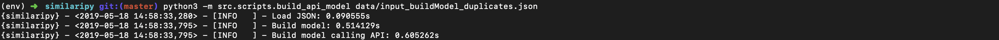
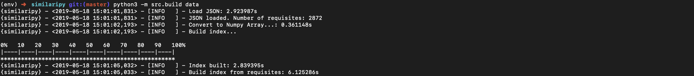
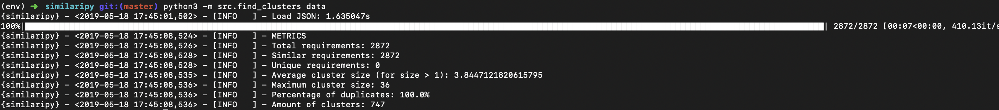
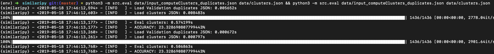

# Similaripy

## What we did

Our approach was to create an N-dimensional index representing the similarity of texts and create clusters from it. 

- Take the matrix from Java
- Create N-dimensional index
- Create algorithm to create clusters
- Implement a 3D dimensional representation

## Usage

### Build model

```bash
python3 -m src.scripts.build_api_model data/input_buildModel_duplicates.json
```




### Get matrix

```bash
python3 -m src.scripts.get_matrix data/input_computeClusters_duplicates.json data/score_matrix.json data/mapping.json
```


### Build index

```bash
python3 -m src.build data
```




### Find clusters

```bash
python3 -m src.find_clusters data 
```




### Eval

```bash
python3 -m src.eval data/input_computeClusters_duplicates.json data/clusters.json && python3 -m src.eval data/input_computeClusters_duplicates.json data/clusters.json 
```


