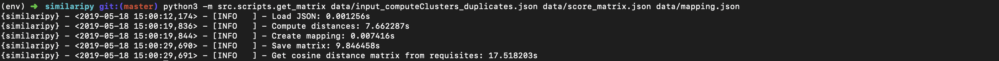

# Similaripy

[](https://github.com/adriacabeza/similaripy/) 

[](http://hits.dwyl.io/adriacabeza/similaripy)
[](https://GitHub.com/adriacabeza/similaripy/stargazers/)
[](https://GitHub.com/adriacabeza/similaripy/network/)
[](https://github.com/adriacabeza/similaripy)
[](https://GitHub.com/adriacabeza/similaripy/graphs/contributors/)
[](https://github.com/adriacabeza/similaripy/blob/master/LICENSE)


📝 Approach for a better clustering built in HackNLP

## What we wanted to do

Our approach was to create an N-dimensional index representing the similarity of texts and create clusters from it. 

- Take the matrix from Java
- Create N-dimensional index
- Create algorithm to create clusters
- Implement a 3D dimensional representation

## What we have done

We have taken the similarity score of all the possible pairs of vectors representation of several texts (requirements) given by ESSI University group project which is calculated using a Cosine distance. Then using that information as a matrix we have created an index using **NMSLIB** (source: https://github.com/nmslib/nmslib) and implemented a **clusterization algorithm** by thresholding and selecting a number of neighbours.

## Challenges we ran into

We did not have a lot of time to develop our ideas. The brainstorming was a little bit rush and we are not used to it.  Moreover, the dataset and method to validate our model were a little difficult to deal with.

## What we learned

We've never used nmslib or neither done a clustering algorithm so we can say that almost everything of what we've done it was new to us.

## What's next for Similaripy

Re-think about the way it is computed the accuracy for the model and experiment with several parameters to get the best result. We could try several ways to compute the distance and its similarity score instead of the Cosine distance.

## Usage

### Build model

```bash
python3 -m src.scripts.build_api_model data/input_buildModel_duplicates.json
```


### Get matrix

```bash
python3 -m src.scripts.get_matrix data/input_computeClusters_duplicates.json data/score_matrix.json data/mapping.json
```




### Build index

```bash
python3 -m src.build data
```


### Find clusters

```bash
python3 -m src.find_clusters data 
```


### Eval

```bash
python3 -m src.eval data/input_computeClusters_duplicates.json data/clusters.json && python3 -m src.eval data/input_computeClusters_duplicates.json data/clusters.json 
```


## License

MIT © Similaripy
